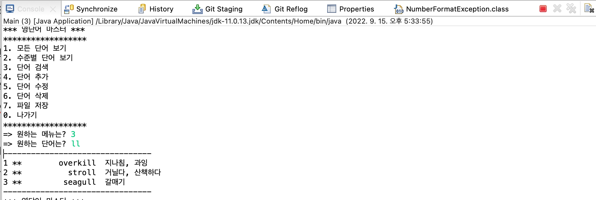
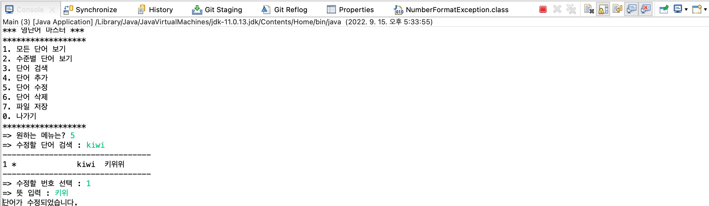
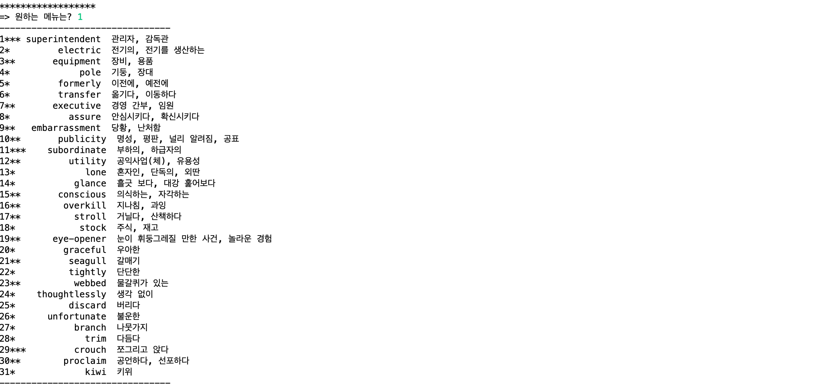
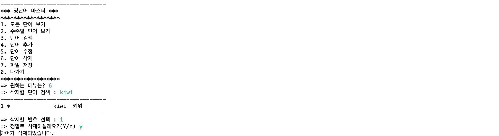
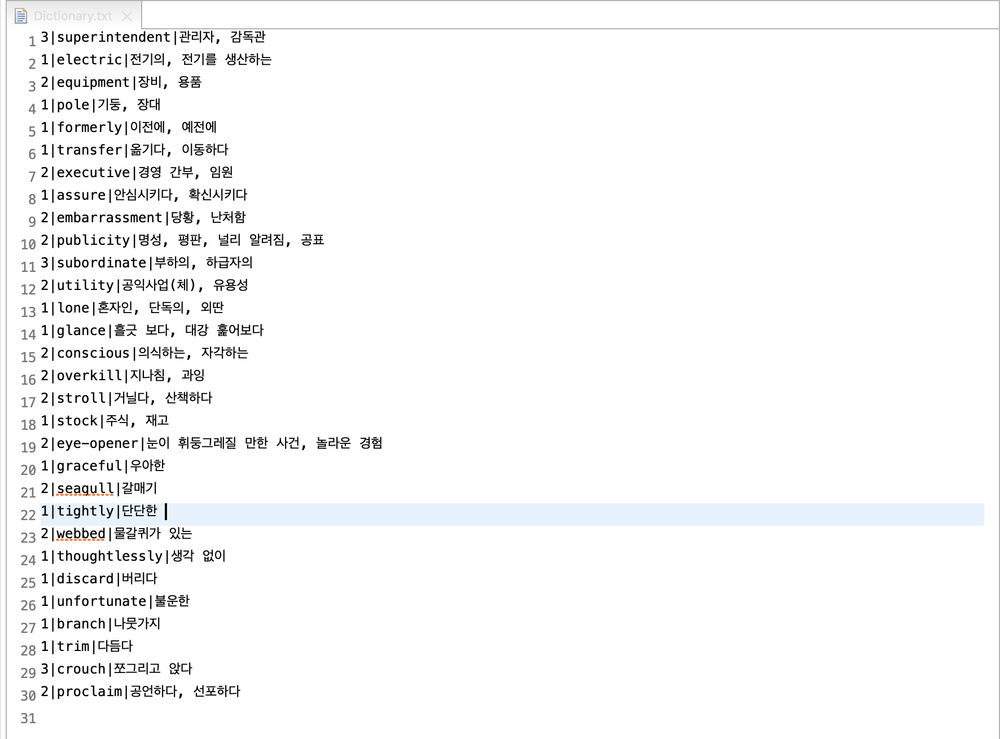
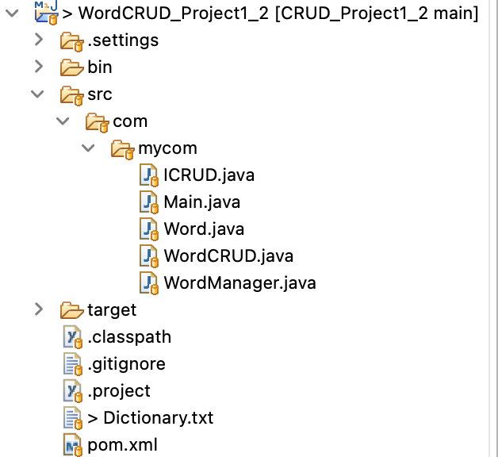
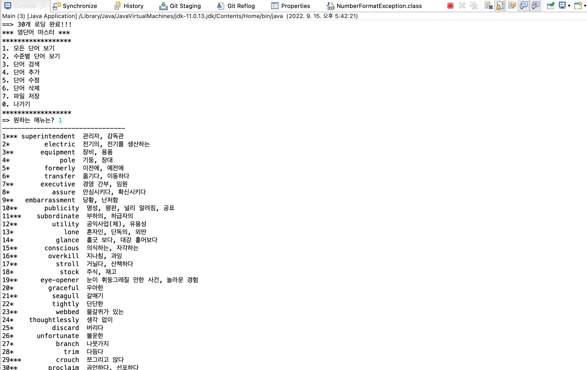

# CRUD_Project1_2

* [2. 수준별 단어보기] 메뉴 실행 화면입니다.
* * *

* [3. 단어 검색] 메뉴 실행 화면입니다.

* [5. 단어 수정] 메뉴 실행 화면과, 단어 수정 메뉴 실행에 따라 수정된 단어 리스트입니다.

* [6. 단어 삭제] 메뉴 실행 화면과, 단어 삭제에 따라 수정된 단어 리스트입니다. 

* [7. 파일저장] 메뉴 실행에 따라 저장된 파일 내용과, 데이터 파일 위치입니다.

* [1. 모든 단어보기] 메뉴 실행 화면입니다. 프로그램을 실행하면 파일의 있는 모든 단어를 가져옵니다. 
